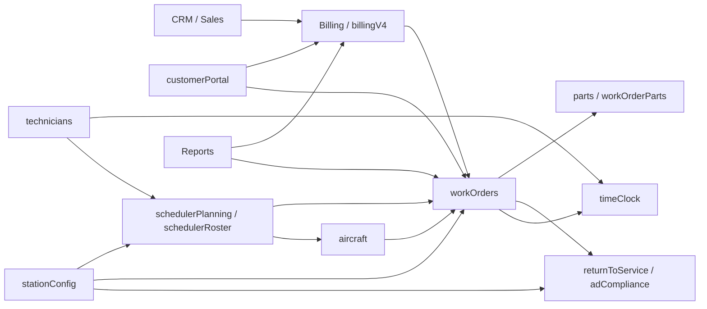

# Athelon App Hierarchy and Interconnectivity Map

## Purpose
This document is a reverse-engineering map for `apps/athelon-app`. It explains the application from three angles at once:

1. User/job hierarchy: who uses the system and what jobs they perform.
2. Page hierarchy: what route surfaces exist and how the internal shell is organized.
3. Subsystem interconnectivity: which shared records and services bind the pages together.

Use this with [`docs/ops/APP-PAGE-INVENTORY.csv`](./APP-PAGE-INVENTORY.csv). The Markdown is the narrative map. The CSV is the exhaustive surface inventory.

## Source Precedence
This map follows the requested precedence order:

1. Router and page code in `src/router/routeModules/*` and `app/**/page.tsx`
2. App shell / RBAC code in `app/(app)/layout.tsx`, sidebar, topbar, guards, and MRO access helpers
3. Convex schema and page-level `api.<module>` usage
4. Derived spec artifacts in `docs/plans/*` and `docs/spec/MASTER-BUILD-LIST.md`

## Snapshot
- Actual live router surfaces: **151**
- Internal live pages: **133**
- Redirect / alias routes: **8**
- Customer portal surfaces: **7**
- Public auth surfaces: **2**
- Catch-all fallback surfaces: **1**
- Convex function modules under `apps/athelon-app/convex`: **98**
- Convex tables in `convex/schema.ts`: **142**
- Derived route registry count: **101**
- Live router surfaces missing from the derived route registry: **50**

The largest live domains by route count are Billing (30), Work Orders (17), Parts (15), Settings (11), Fleet (10), and CRM (10).

The highest-connectivity backend spine is centered on `workOrders`, `billing` / `billingV4`, `technicians`, `aircraft`, `timeClock`, `customerPortal`, and `stationConfig`.

## App Boundaries
| Boundary | Main routes | Key components / gates | Why it matters in a rebuild |
| --- | --- | --- | --- |
| Public auth/session | `/sign-in/*`, `/sign-up/*` | `src/bootstrap/main.tsx`, `components/ProtectedRoute.tsx`, Clerk provider | If auth flow is rebuilt separately from route protection, every internal route can regress or flash unauthorized content. |
| Onboarding/bootstrap | `/onboarding` plus `OnboardingGate` redirects | `components/OrgContextProvider.tsx`, `components/OnboardingGate.tsx`, `api.onboarding.getBootstrapStatus`, `api.technicians.getMyContext` | The app is not just authenticated vs unauthenticated. It also has a bootstrap state and a profile-link state. |
| Internal operations shell | All internal routes under `AppLayout` | `app/(app)/layout.tsx`, `AppSidebar`, `TopBar`, `CommandPalette`, `KeyboardShortcuts`, `PWAInstallPrompt`, `OfflineStatusBanner`, `RouteGuard` | This shell is where cross-cutting navigation, RBAC, notifications, timers, and offline behavior are combined. |
| Customer portal | `/portal/*` and `/portal/sign-in` | `CustomerAuthProvider`, `CustomerProtectedRoute`, `app/(customer)/layout.tsx`, `api.customerPortal.*` | The portal is a separate audience with different auth context, navigation, and record visibility rules. |
| Fallback / edge surfaces | `/billing`, `/compliance/certificates`, `/squawks`, `/not-found`, `*` | Router redirects and explicit not-found page | These paths preserve discoverability and legacy entry points. They are easy to drop during consolidation. |

## Navigation Hierarchy
```mermaid
flowchart TD
    App[Athelon App]
    App --> Auth[Public Auth Boundary]
    Auth --> SignIn[/sign-in/*]
    Auth --> SignUp[/sign-up/*]

    App --> Onboarding[Bootstrap Boundary]
    Onboarding --> Onboard[/onboarding]

    App --> Internal[Internal Operations Shell]
    Internal --> Dashboard[Dashboard]
    Internal --> WorkOrders[Work Orders]
    Internal --> Fleet[Fleet]
    Internal --> Parts[Parts]
    Internal --> Scheduling[Scheduling]
    Internal --> Compliance[Compliance]
    Internal --> Billing[Billing]
    Internal --> Sales[Sales]
    Internal --> CRM[CRM]
    Internal --> Personnel[Personnel]
    Internal --> OJT[OJT / Training]
    Internal --> Reports[Reports]
    Internal --> Settings[Settings]
    Internal --> Lead[Lead Center]
    Internal --> MyWork[My Work]
    Internal --> Findings[Findings]

    App --> Portal[Customer Portal]
    Portal --> PortalSignIn[/portal/sign-in]
    Portal --> PortalDash[/portal]
    Portal --> PortalWO[/portal/work-orders]
    Portal --> PortalQuotes[/portal/quotes]
    Portal --> PortalInvoices[/portal/invoices]
    Portal --> PortalFleet[/portal/fleet]
    Portal --> PortalMessages[/portal/messages]

    App --> Edge[Fallback / Legacy Surfaces]
    Edge --> BillingAlias[/billing -> /billing/customers]
    Edge --> SquawksAlias[/squawks -> /findings]
    Edge --> ComplianceAlias[/compliance/certificates -> /compliance/audit-trail]
    Edge --> NotFound[/not-found]
    Edge --> CatchAll[*]
```

## Internal Domain Tree
| Domain | Representative routes | Primary job | Dominant modules | Depends on | Links out to |
| --- | --- | --- | --- | --- | --- |
| Dashboard | `/dashboard` | Cross-shop status rollup | `adCompliance`, `capacity`, `hangarBays`, `schedulerRoster`, `timeClock`, `workOrders` | Scheduling, compliance, work orders, time tracking | Fleet and work orders |
| Lead Center | `/lead` | Lead assignment, turnover, and crew coordination hub | `leadTurnover`, `workOrders` | Work orders | Scheduling, OJT training, dashboard |
| My Work | `/my-work`, `/my-work/time` | Technician execution and personal labor capture | `taskCards`, `timeClock`, `workOrders` | Work orders, time tracking | Personnel, work orders |
| Findings | `/findings` plus work-order discrepancy detail | Discrepancy triage and escalation | `discrepancies`, `workItemEntries` | Work orders, compliance | Work orders |
| Work Orders | `/work-orders`, `/work-orders/:id`, task cards, execution, RTS, release | Core execution spine from intake through signoff | `workOrders`, `taskCards`, `timeClock`, `parts`, `returnToService`, `gapFixes` | Settings, parts, compliance, billing, time tracking | Fleet, billing, parts, findings, onboarding |
| Fleet | `/fleet`, aircraft detail, calendar, predictions, LLP, maintenance programs | Aircraft state, planning horizon, maintenance history | `aircraft`, `maintenancePrograms`, `predictions`, `fleetCalendar`, `workOrders` | Billing, parts, work orders, documents | Work orders, CRM, personnel |
| Parts | `/parts`, receiving, requests, tools, lots, tags, warehouse, alerts | Material flow, receiving, traceability, logistics | `parts`, `inventoryAlerts`, `poReceiving`, `toolCrib`, `lots`, `warehouseLocations`, `rotables`, `loaners`, `cores` | Billing procurement, personnel, work orders | Work orders, billing, onboarding |
| Scheduling | `/scheduling`, bays, capacity, roster, due-list, quotes | Capacity planning and bay/crew coordination | `schedulerPlanning`, `schedulerRoster`, `capacity`, `hangarBays`, `stationConfig`, `workOrders` | Work orders, settings, personnel | Dashboard, work orders, onboarding |
| Compliance | `/compliance`, QCM review, audit trail, AD/SB, audit readiness, diamond award | Regulatory traceability and signoff readiness | `adCompliance`, `maintenanceRecords`, `returnToService`, `releaseCertificates`, `aircraft`, `training` | Fleet, work orders, findings, settings, personnel | Fleet, work orders, OJT training |
| Billing | `/billing/*` | Customers, invoices, AR, PO/vendor, pricing, time approval | `billing`, `billingV4`, `billingV4b`, `customers`, `vendors`, `pricing`, `laborKits`, `warranty` | Personnel, work orders, settings, customer portal | Sales, work orders, fleet |
| Sales | `/sales/*` | Commercial pipeline and quote execution | Billing quote pages reused under sales routes, plus `crm` and `quoteTemplates` | Billing and CRM | CRM |
| CRM | `/crm/*` | Accounts, contacts, interactions, pipeline, prospect intelligence | `crm`, `crmProspects`, `billingV4`, `customers`, `aircraft`, `workOrders` | Billing, fleet, work orders | Billing, sales, work orders |
| Personnel | `/personnel/*` | Roster, training state, time management | `technicians`, `technicianTraining`, `training`, `timeClock` | OJT training and time tracking | OJT training |
| OJT / Training | `/training/ojt/*` | Curricula, jackets, trainer authorization, enrollment | `ojt`, `ojtEnrollment`, `ojtAuthorizations`, `technicians` | Personnel | - |
| Reports | `/reports/*` | Financial, inventory, revenue, throughput reporting | `billing`, `customers`, `workOrders`, `inventoryValuation` | Billing, work orders, parts | Billing, work orders |
| Settings | `/settings/*` | Org governance, config, imports, notifications, external integrations | `stationConfig`, `shopLocations`, `userManagement`, `bulkImport`, `quickbooks`, `notifications`, `emailLog` | Fleet, shared services, shared workflow | Onboarding, billing |

## Role / Job Overlay
| Role / audience | Primary jobs | Primary surfaces |
| --- | --- | --- |
| `admin` | Cross-module governance and override access | Settings, users, station config, all major domains |
| `shop_manager` | Run the shop, coordinate labor, see the whole board | Dashboard, work orders, fleet, scheduling, parts, reports, settings |
| `qcm_inspector` | Quality signoff, audit prep, compliance review | Compliance, audit trail, AD/SB, RTS/release, selected work-order surfaces |
| `billing_manager` | Commercial ops, AR, invoicing, time approval | Billing, sales, CRM, reports |
| `lead_technician` | Assign work, manage execution, handoffs, scheduling coordination | Lead Center, work orders, my work, scheduling, parts, fleet |
| `technician` | Execute task cards and capture labor / findings | My Work, task cards, work-order detail, parts requests, fleet read access |
| `parts_clerk` | Receiving, warehouse, logistics, purchase support | Parts, PO receiving, alerts, shipping, selected billing procurement pages |
| `sales_rep` | Quote creation, prospecting, CRM updates | Sales, CRM, quote flows |
| `sales_manager` | Pipeline oversight, pricing/commercial control | Sales, CRM, billing-adjacent commercial pages |
| `read_only` | Oversight without editing | Dashboard, fleet, reports, selected read-only views |
| `customer_portal_user` | Track own work orders, quotes, invoices, fleet, messages | `/portal`, `/portal/work-orders`, `/portal/quotes`, `/portal/invoices`, `/portal/fleet`, `/portal/messages` |

The actual enforcement path is layered, not single-source:
- `ROLE_PERMISSION_GRANTS` and `ROUTE_PERMISSION_RULES` in `src/shared/lib/mro-access.ts`
- Sidebar section filtering in `src/shared/components/AppSidebar.tsx`
- Route-level redirects in `src/shared/components/RouteGuard.tsx`
- Session gates in `ProtectedRoute`, `OnboardingGate`, and `CustomerProtectedRoute`

That means a redesign must preserve both visible navigation rules and hidden route-level access behavior.

## Main Functions Combined In This Application
| Cross-cutting function | Primary implementation anchors | What it ties together |
| --- | --- | --- |
| Clerk auth/session | `src/bootstrap/main.tsx`, `ProtectedRoute`, auth pages | Public auth entry, protected internal routes, customer portal sign-in state |
| Org bootstrap + profile linkage | `OrgContextProvider`, `OnboardingGate`, `api.onboarding`, `api.technicians.getMyContext` | Session -> org -> technician context before the internal app can work |
| RBAC + route access | `src/shared/lib/mro-access.ts`, `AppSidebar`, `RouteGuard` | Role-scoped nav, route permission checks, role badges, workflow visibility |
| Internal shell navigation | `AppLayout`, `AppSidebar`, `TopBar` | Sidebar hierarchy, topbar tools, org switcher, notifications, quick routing |
| Command palette + shortcuts | `CommandPalette`, `KeyboardShortcuts` | Fast access to high-value routes and create flows across domains |
| Notifications + alerts | `TopBar`, `api.notifications.*`, `api.inventoryAlerts.*` | Operational changes surface globally, not just on their owning page |
| Global timer / labor capture | `GlobalTimerWidget`, `api.timeClock.*`, task-card and billing time pages | Work execution, technician time, billing approval, dashboard metrics |
| PWA + offline shell | `registerServiceWorker`, `PWAInstallPrompt`, `OfflineStatusBanner` | The app expects semi-field use, not just office desktop browsing |
| Document / evidence handling | `api.documents.*`, `returnToService`, `maintenanceRecords`, parts/fleet/work-order evidence pages | Compliance evidence, attachments, RTS records, aircraft records |
| Customer portal auth context | `CustomerAuthProvider`, `CustomerProtectedRoute`, `api.customerPortal.getCustomerByEmail` | Maps a signed-in Clerk user to customer-facing access rather than technician access |

## Dependency Spine
| Back-end spine module | Pages touching it | Why it matters |
| --- | --- | --- |
| `workOrders` | 29 | Primary operational record tying dashboard, scheduling, fleet, billing, and execution together. |
| `billing` / `billingV4` | 36 combined page touches | Commercial layer is split across multiple Convex modules and reused by sales, reports, CRM, and fleet surfaces. |
| `technicians` | 17 | Personnel identity leaks into billing, training, scheduling, parts, and execution. |
| `aircraft` | 15 | Fleet state is reused by compliance, predictions, work order creation, CRM, and customer visibility. |
| `timeClock` | 7 | Labor capture feeds work execution, billing approval, dashboard metrics, and personal time views. |
| `customerPortal` | 7 | Separate audience but directly coupled to billing customers, request intake, and work-order visibility. |
| `stationConfig` | 6 | Configuration affects scheduling, compliance readiness, work-order detail, and capabilities/settings. |



## Workflow Interconnectivity
### 1. CRM / Sales -> Quotes -> Work Orders
CRM and sales pages collect account context, prospect intelligence, and quote workflow. Quote routes live under `/sales/*`, but their backing page files still sit under `app/(app)/billing/quotes/*`. That is the clearest sign that commercial operations grew out of the billing domain rather than a separate sales package. Once a quote is accepted or operationally relevant, it feeds work-order creation and scheduling conversations.

### 2. Work Orders -> Task Cards / My Work -> Findings / Compliance
`workOrders` is the operational hub. It fans into task cards, execution, technician labor capture, findings, records, RTS, release, signatures, and QCM review. If you rebuild work orders as a narrow ticket entity and forget its downstream edges, you will drop task execution, compliance evidence, and labor/billing linkage.

### 3. Work Orders -> Parts / Procurement / Receiving
The work-order detail surface and task-card flows touch parts demand, requests, issued parts, installed parts, receiving work orders, tooling, and procurement. Parts is not a separate warehouse system bolted on later; it is part of the execution model.

### 4. Fleet -> Work Orders / Scheduling / Predictions / Logbooks
Fleet is not just an asset list. Aircraft state feeds work-order creation, maintenance programs, LLP tracking, predictions, ADS-B-related settings, and logbook/compliance history. Scheduling also reads fleet state indirectly through the same work-order and bay-assignment model.

### 5. Time Tracking -> Billing / AR / Reports
`timeClock` appears in task execution, technician views, billing time clock, time approval, dashboard KPIs, and work-order dashboards. Labor is both an execution concern and a commercial/reporting concern.

### 6. Customer Requests / Portal -> Billing / Work Order Visibility
The customer portal is coupled to billing customers via `api.customerPortal.getCustomerByEmail` and also feeds internal customer-request queue handling. Portal redesign should preserve both read-only status visibility and request-intake feedback loops.

### 7. Personnel / OJT / Training -> Scheduling and Compliance Readiness
Personnel, OJT, technician training, Diamond Award tracking, and audit readiness share technician and training data. This is the training-to-readiness loop. Removing it turns compliance into a static checklist instead of an operational readiness function.

### 8. Settings / Station Config / Locations -> Scheduling, Work Orders, Compliance
`stationConfig` and `shopLocations` are quiet but important. They influence work-order routing context, scheduling assumptions, readiness logic, and capabilities. Settings should be treated as operational infrastructure, not just an admin appendix.

## Hidden and Edge Surfaces
| Surface | Type | Why it exists | Reverse-engineering risk |
| --- | --- | --- | --- |
| `/billing` | Redirect | Umbrella entry that lands on customers | If removed, saved links and mental model for “billing home” break. |
| `/compliance/certificates` | Redirect | Certificates concept resolves into audit-trail tooling | If rebuilt as a dead page, certificate work can split from the actual compliance ledger. |
| `/squawks` | Alias redirect | Legacy discrepancy terminology preserved as an entry point | If removed, older terminology and bookmarked links stop resolving to findings. |
| `/billing/quotes`, `/billing/quotes/new`, `/billing/quotes/templates`, `/billing/quotes/:id` | Legacy quote aliases | Old billing-centered quote URLs normalize into sales routes | If omitted, quote history/bookmarks and internal habits break during commercial workflow refactor. |
| `/sales/quotes*` backed by `app/(app)/billing/quotes/*` | File/route mismatch | Quote implementation still lives under billing page files | If teams reorganize folders without mapping route behavior, quote features can be lost or duplicated. |
| `/portal/sign-in` and `/portal/messages` | Live portal surfaces absent from derived route registry | Router truth is ahead of the spec export here | If you rely only on derived route docs, customer authentication and communication features disappear from the redesign scope. |
| `/not-found` and `*` | Explicit and implicit fallback surfaces | Both an addressable not-found page and a catch-all exist | If only one is preserved, some fallback flows and guard redirects become harder to reason about. |

### Registry drift to keep in mind
The derived route registry under `docs/plans/MASTER-ROUTE-CAPABILITY-REGISTRY.csv` is useful for latent/spec context, but it is behind the live router. There are **50** live surfaces missing from that derived file. Representative examples: /portal/sign-in, /portal/messages, /work-orders/handoff, /work-orders/:id/findings/:discrepancyId, /fleet/llp, /fleet/maintenance-programs, /fleet/maintenance-programs/:id, /fleet/:tail/llp, /fleet/:tail/adsb, /parts/alerts, /parts/lots, /parts/receiving/po, ...

## Current Live Surface vs Latent Spec Coverage
Current live behavior should come from the router, pages, shell, and Convex usage. Latent or partially implemented capability should come from the crosswalk and feature registry.

Crosswalk rollup status distribution:
- Implemented groups: **2**
- Partial groups: **11**
- Missing groups: **6**
- Proposed groups: **5**

Interpretation:
- `implemented` means the capability family is materially present.
- `partial` means there is enough live surface area that a redesign can accidentally break it, even if the family is incomplete.
- `missing` means the docs/spec expect it, but the live app does not fully supply it.
- `proposed` means it belongs in future-state thinking, not in present-state behavior assumptions.

| Group | Capability | Wave | Status | Atomic count |
| --- | --- | --- | --- | --- |
| GRP-001 | Identity and RBAC Control Plane | Wave0 | partial | 7 |
| GRP-002 | Audit, Event Ledger, and Taxonomy | Wave0 | implemented | 2 |
| GRP-003 | Work Order Core Execution | Wave1 | partial | 11 |
| GRP-004 | Quote Governance and Commercial Controls | Wave1 | partial | 4 |
| GRP-005 | Signoff Authority and Inspection Controls | Wave1 | partial | 3 |
| GRP-006 | Parts Traceability and Receiving | Wave2 | missing | 8 |
| GRP-007 | Inventory and Tooling Operations | Wave2 | missing | 4 |
| GRP-008 | Lead Workspace and Turnover | Wave3 | missing | 6 |
| GRP-009 | KPI, Dashboard, and Reporting Surfaces | Wave3 | partial | 13 |
| GRP-010 | Fleet/WO Discoverability and UX Views | Wave4 | missing | 5 |
| GRP-011 | Evidence Hub and Media Platform | Wave4 | partial | 7 |
| GRP-012 | Scheduling Engine and Capacity Intelligence | Wave5 | partial | 13 |
| GRP-013 | Predictive Maintenance Intelligence | Wave5 | missing | 4 |
| GRP-014 | Cross-Module Data Bus and Integrations | Wave5 | partial | 3 |
| GRP-015 | Customer Portal and Communications | Wave4 | partial | 9 |
| GRP-016 | Training and OJT Program | Wave3 | partial | 4 |
| GRP-017 | Regulatory and Certification Framework | Wave1 | missing | 10 |
| GRP-018 | Financial Planning and P&L Intelligence | Wave3 | partial | 8 |
| GRP-019 | Marketplace and Talent Matching | Wave6 | proposed | 1 |
| GRP-020 | Industry Benchmarking and Quote Book | Wave6 | proposed | 1 |
| GRP-021 | Reliability and Hardening Program | Wave0 | implemented | 3 |
| GRP-022 | PDF/Document Export and Report Artifacts | Wave1 | proposed | 8 |
| GRP-023 | Notifications and Alerting | Wave3 | proposed | 6 |
| GRP-024 | UX Polish and Finishing Layer | Wave4 | proposed | 13 |

## Rebuild Guidance
- Treat `workOrders`, `aircraft`, `billing` / `billingV4`, `technicians`, `timeClock`, `customerPortal`, and `stationConfig` as the seven-node dependency spine. Any modular redesign should explicitly preserve or re-home those relationships.
- Preserve route aliases and non-obvious redirect surfaces until you intentionally deprecate them with a migration plan.
- Keep customer portal architecture separate from technician/internal architecture even when records overlap.
- Do not trust folder names alone. Quote functionality is the clearest example: route ownership and file ownership still diverge.
- Use the CSV inventory as the page-by-page checklist before removing or consolidating any route.
